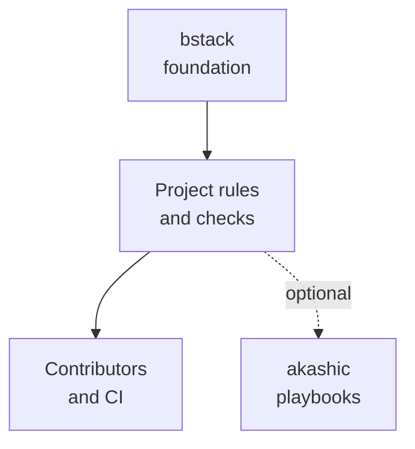
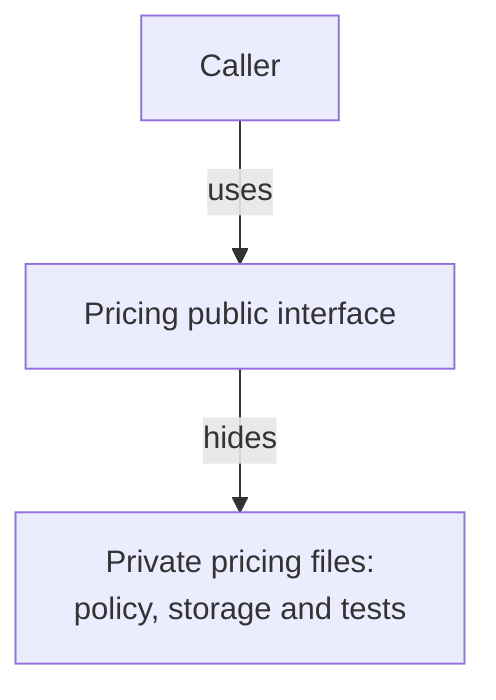

## Summary

**bstack helps developers design project-specific guidelines, rules and checks that give agents a sound foundation to extend.**
Agent drift means changes that depart from the project's agreed purpose, design or behaviour.
The first release centres on `repo-audit` and includes everything that skill needs.
It helps you establish a new project and strengthen an existing repo before more changes add technical debt.
Technical debt means design or implementation choices that make later changes harder or less reliable.

For a new idea, the skill first asks what you are building and why.
For an existing project, it first audits the repo and reads relevant files to understand the purpose, goals and defined principles.
It uses Matt Pocock's `grill-me` interview method only where intent or important design decisions remain unclear.
It then recommends guidelines and protections tailored to that project's goals, structure and risks.
Suitable principles become native lint rules, scripts or other checks.

New projects establish `VISION.md`, while existing projects reuse their approved documents and propose updates only where needed.
The skill also maintains resolved project vocabulary and identifies standards that need judgement rather than an automated check.
You review the proposed foundation before the agent applies changes.

This design owns the first-release requirements.
The [implementation plan](implementation-plan.md) owns the build sequence and the evidence each task records.
"Commissioning decisions (2026-10-07)" below records the choices settled before the build started.
Runtime research and build prerequisites remain assigned to the tasks that need them.
The decisions table in "Scope and decision history" holds the only record of superseded designs.

The [implementation plan](implementation-plan.md#progress) records completed packaging and runtime checks; unchecked capabilities remain build work.
The new-project path can implement the approved foundation, but it does not build the full product during setup.

### Your current decisions

| Decision | Current direction |
|---|---|
| Release scope | `repo-audit` plus its full dependency set |
| Existing repos | Audit the repo and relevant files first, then recommend improvements and apply the changes you choose |
| Project intent | Interview first for a new idea, establish existing-project intent from repo evidence before asking about gaps |
| Interview | Use `grill-me` for unresolved intent and decisions, without asking users to repeat what the repo explains |
| Project vision | Include VISION.md support in the initial setup for a new project |
| Scripted safeguards | Script predictable audit, write and evidence operations to prevent agent mistakes |
| Architecture audit | Assess coupling, files with unrelated responsibilities and shared edit targets that make parallel changes difficult |
| Verification | Evidence must validate the original user outcome, without default autonomous TDD |
| Product boundary | bstack owns project guidance and checks. akashic, a separate project, owns workflow routing and execution |
| Foundation goal | Design project-specific guidelines and protections that agents can extend, without prescribing implementation steps |
| Research | Send read-heavy research to subagents where the host has them, otherwise run it in the main thread |
| Context use | Install every bundled file, but read each one only when the current step needs it |
| Invocation | Only the user can start repo-audit, in every supported host |
| Skill authoring | Write repo-audit for the same process on every run, with checkable step criteria and tests with and without the skill |
| Languages | General design principles in the skill, with language practice researched for each project at audit time |
| Models and hosts | Works with any capable model and any host that supports skills. Basic tests run in whatever agent runs them, with no host or model matrix |
| Install and release | A Node installer for Windows, macOS and Linux, from manually approved Git tags and GitHub releases, with no package |
| Agent instructions | One root `AGENTS.md`. Equivalent repo-owned `CLAUDE.md` content, including a stub that imports `AGENTS.md`, merges into it through reviewed protected edits. Scoped instructions keep their meaning |
| bstack's own delivery | The no-mistakes pipeline with no hosted CI, plus recorded local and clean-checkout runs |

### Recommendations carried into this design

- Include all interview and VISION resources in the installed `repo-audit` folder.
- Adapt VISION for projects with no history, using your approved intent as evidence.
- Keep purpose in `VISION.md`, technical design in the project's design document, and executable rules in their native tool configs.
- Prove each new automated rule rejects a real violation and accepts valid code.
- Keep existing debt visible and prevent new violations while you address the agreed findings.
- Put predictable audit and maintenance operations in tested scripts instead of relying on the agent to repeat them correctly.
- Organise code around responsibilities and stable interfaces so unrelated changes can stay in separate parts of the repo.
- Include glossary support and preserve one source for each coding standard, creating a separate standards file only when it adds value.
- Install a hybrid maintenance contract so future changes check documentation impact and run the same project rules.

These are design recommendations, rather than claims that the skill already exists.

### Commissioning decisions (2026-10-07)

This design and the implementation plan were migrated into the public bstack repo on 2026-10-07.
Their source is `projects/bstack/plan.md` and `projects/bstack/implementation-plan.md` in the owner's private repo `knowttl/brytton`, at commit `28191a1def2c6c89b6a60d95f00056aaacfea669`.
These copies are now authoritative, and readers need no access to that source.

Decisions already given before commissioning:

- bstack is the public repo `knowttl/bstack`.
- GitHub Actions is disabled for bstack, and the repo has no workflows.
- bstack's delivery is the no-mistakes pipeline with unattended merge of green work; [the delivery gate](implementation-plan.md#delivery-gate) describes its current configuration.

The owner approved the commissioning review and its six recommendations as written:

1. **No hosted CI for bstack.** No-mistakes plus recorded local and clean-checkout execution replace every hosted-CI criterion, including T0.6, the T1.6 setup, T3.4, T3a.6, T4.3 and the T5.2 evidence.
   Optional CI guidance for target projects remains an explicitly selected integration, and hosted behaviour that bstack has not executed is reported unverified.
   AC-24 is restated as a clean-checkout execution case.
   Every other behaviour control stays, and bstack adds no workflows or release automation.
2. **Three operating systems.** The installer keeps Windows, macOS and Linux support.
   AC-74 passes only after one real local or manual run on each operating system, supplemented by local Node 24 and Node 26 runs.
   A Linux run does not substitute for another operating system.
3. **Small slices.** The build runs as the commissioning slices C0 to C29 in the implementation plan, beginning with C0 and C1, with Phase 0 first.
   T3.1's enforcement and architecture guidance is written before T2.8.
   The full first-release scope is preserved.
4. **Baseline evaluation.** The baseline needs at least three realistic comparable scenarios and retains the cases it already passes.
   The earlier quota of three observed failures is removed, as "Testing" under "How repo-audit itself is written" now states.
5. **Scoped instructions.** The audit preserves the meaning of scoped instructions and consolidates equivalent repo-owned `CLAUDE.md` content only through reviewed protected edits.
   It reports ancestor and local shadowing without modifying files outside the selected repo.
6. **Automatic review repair budget.** The current budget and build review focus are owned by `.no-mistakes.yaml`; see [the delivery gate](implementation-plan.md#delivery-gate).

## Project-specific foundation

The output is a foundation for the target project, rather than a universal set of implementation instructions.
Reusable bstack principles inform recommendations, but the project's approved goals and design determine which rules belong there.
The owner's rationale is that agents tend to follow and extend patterns already present in a repo.
Good examples, clear boundaries and enforceable rules must therefore reinforce the same design.

The foundation must make the following clear:

- What the project owns, what it excludes and which behaviours contributors must preserve.
- Which module owns each important responsibility, and which interfaces contributors can extend.
- Where contributors find authoritative guidance and representative examples of approved patterns.
- Which project-specific constraints tools enforce, and which decisions still need judgement.
- What evidence demonstrates that an extension fits the design and solves the intended user problem.

Guidelines explain what must remain true, why the requirement matters and where it applies.
They leave implementation choices open within those constraints.
Native configuration owns executable rules, while design documents explain their rationale without duplicating settings.
Custom scripts or lint rules address concrete gaps that existing tools cannot enforce reliably.
Do not create a custom checker, abstraction or document merely to complete a standard template.

For existing projects, identify sound patterns worth preserving and inconsistent patterns that need a selected correction.
A common pattern is evidence of current practice, not automatic proof that the design is sound.
Do not encode existing debt as a permanent standard merely because agents already copy it.
For new projects, selected setup provides representative examples only where the approved foundation needs them.
Those examples demonstrate usable boundaries and checks without building speculative product features.

Success means a representative future change can discover the relevant guidance and extend the foundation without inventing a competing pattern.
The extension must preserve approved boundaries and behaviour, with evidence from the maintained checks and any required review.
This requirement does not prescribe the steps the agent must use to implement that change.

## Product boundary

bstack defines what a healthy project must preserve and how contributors can verify those requirements.
akashic, a separate project, defines how work runs through playbooks.
Neither project requires an installation of the other.

| Concern | bstack | akashic |
|---|---|---|
| Purpose and language | Help establish vision, vocabulary, boundaries and non-goals | Use approved project guidance when making decisions |
| Design and standards | Recommend scoped principles, architecture constraints and judgement rules | Require relevant rules in work briefs and playbooks |
| Verification | Establish native checks, evidence requirements and their coverage limits | Select and run checks, assess gates and record execution |
| Documentation currency | Define required impact assessments and provide mechanical validators | Decide where assessment and review belong in a playbook |
| Work execution | Provide explicitly invoked foundation skills and bounded check tools | Route tasks, order steps, coordinate agents, recover runs and deliver changes |

The linked [poteto-mode guide](https://github.com/backnotprop/pstack/blob/124f622bcaeac490e7e9dac6af83f3ef9611d554/docs/guide/02-poteto-mode.md) describes automatic playbook selection and sequencing.
bstack does not adopt that responsibility.
It contains no task router, sticky execution mode, general implementation playbooks or autonomous restart service.
Those capabilities belong to akashic when wanted, rather than a later bstack release.

Security of the skills bstack creates is also outside its scope.
That covers attacks through skill files, scripts or web content the agent reads.

### Requirements need enforcement

High-level prose alone cannot prevent drift or establish trust.
Keep executable project checks and precise completion evidence in bstack's foundation design.
The project owns its approved rules, and checks enforce only their supported constraints.
Judgement rules still need review, with limitations visible.

For example, a project can forbid UI imports of storage internals.
bstack helps define that boundary and installs the selected native import check.
Akashic can require that command in a feature playbook and decide how a failure affects the run.
A contributor can run the same command without either skill pack installed.

The project requirements are the shared source, rather than duplicated rules inside each playbook.

### Bounded skill mechanics

An invoked foundation skill still needs enough instructions to perform its own job reliably.
repo-audit must inspect existing repos before asking the owner to repeat documented goals.
New ideas require explained intent before project-specific recommendations.
Selected edits require review, protected writes and actual verification evidence.
These safeguards govern repo-audit's bounded operation, rather than prescribing every future development task.

Interview resources, VISION assets and document validators remain included because repo-audit needs them.
They do not become a general-purpose workflow registry or a task classifier.
The sections below specify the evidence and outputs that repo-audit must provide.

### Load only what each step needs

**repo-audit installs every bundled file, but the agent reads a file only when the current step needs it.**
Files the agent does not read cost no context.
Anthropic's [skill authoring best practices](https://platform.claude.com/docs/en/agents-and-tools/agent-skills/best-practices) describe this loading model, which the guide calls progressive disclosure.

At startup the host loads only each skill's name and description.
It loads the `SKILL.md` body when the user invokes the skill.
It loads a bundled file only when the agent reads that file.
So `SKILL.md` controls what loads, and it must name the one file for each step.

`SKILL.md` contains a "load when" table.
Each row pairs a condition with the one file to open.
The build fixes the final file names, and the names below show the pattern.

| When | Open |
|---|---|
| A new idea with no repo | `references/intent-interview.md` |
| An unresolved decision would change a recommendation | `references/grilling.md` |
| Project terms are unclear or conflict | `references/domain-language.md` |
| No `VISION.md`, or the audit found a vision gap | `references/vision.md` |
| Recommending principles and their checks | `references/enforcement.md` |
| Recommending module boundaries | `references/architecture.md` |
| Delegating research | `references/research-briefs.md` |
| Recording change evidence | `references/maintenance-contract.md` |

Rules for loading:

- `SKILL.md` never tells the agent to read the whole folder or to read files in advance.
- Every reference links directly from `SKILL.md`. A reference file does not send the agent on to another reference file.
- The build flattens upstream chains. `grill-me` delegates to `grilling` upstream, so `SKILL.md` links the `grilling` procedure directly.
- The agent runs each script by its documented command and reads only the output. It does not read the script source.
- Templates, stylesheets and board assets are inputs to scripts. The agent passes their paths and does not read them.
- The `SKILL.md` body stays under 500 lines, the limit in Anthropic's guide.
- A reference file over 100 lines starts with a table of contents, so a partial read still shows its scope.
- A file read once in a run is not read again, unless it changed.

Claude Code loads skills this way.
The basic tests check this in whatever agent runs them. bstack does not test each host separately.

## repo-audit capability requirements

The skill handles new ideas and existing foundations within the user's requested scope.
An empty repo can still represent a new idea.
An established repo may need only a scoped reassessment.
The user and agent must resolve unclear scope before applying changes.
Requests for unrelated product implementation remain outside this skill's responsibility.
An audit can record technical uncertainty without inventing a product goal or silently launching another workflow.

### Establish the project intent

For a new idea, ask the user what they plan to build or change.
If the user already explained the idea, summarise that explanation and ask only about the gaps.
For an existing project, complete the initial repo audit described below before interviewing the user.
Use its relevant documents and implementation to establish what you can verify about the purpose and goals.
Label inferred intent and contradictions, and ask only about gaps that affect the recommendations.
Do not recommend a language, framework or lint preset before understanding the project.

The evidence review or interview establishes:

- The problem, intended users and outcome that makes the project successful.
- The first useful user journey and the work outside the project's scope.
- The data, interfaces, deployment environment and important reliability or access constraints.
- Existing decisions, technical constraints and behaviour that must remain compatible.
- The trade-offs that would change the system's shape or its acceptance criteria.

Use the `grill-me` decision tree approach.
Resolve parent decisions before asking questions that depend on them.
Give a recommendation and explain the relevant trade-off with each decision question.
Group only independent questions into a small round, then wait for the answers.
Read the repo and available documentation to answer factual questions instead of asking the user to look them up.

Use the local domain-language procedure alongside the interview when project terms need clarification.
It complements `grill-me` rather than adding another mandatory interview.

Finish with a concise account of the agreed goal, boundaries, decisions and remaining uncertainties.
For an existing project, cite the supporting files and separate documented goals from inferred behaviour.

The user confirms new or changed intent before the agent implements work that depends on it.
Do not require the user to repeat or reconfirm an approved vision merely to complete the audit.
Do not treat silence or an interrupted session as confirmation.

### Establish VISION.md

Use the [VISION workflow](https://github.com/kunchenguid/vision) as the basis for a contribution acceptance policy.
A contribution acceptance policy explains which future changes fit the project and which changes reviewers should resist.
It is not a feature backlog or an implementation plan.

For a new idea, derive the draft from the user's stated intent and confirmed decisions.
Identify those as author decisions, rather than claiming support from nonexistent commits or pull requests.

For an existing repo, read its approved vision, design documents, code and accessible history.
Separate what the code currently does from what the owner intends it to become.
Present contradictions for a decision instead of treating every historical pattern as a principle.
An existing-project audit does not require a new vision interview or review board when the current vision already serves the project.
Recommend a new vision or a reviewed delta only when the audit identifies a material gap or requested change in direction.

The vision contains:

- Why the project exists and who it serves.
- The capability or responsibility it owns.
- Concrete commitments, boundaries and non-goals.
- Criteria for accepting or resisting a proposed change.

Stress-test the draft with concrete proposals that expose real trade-offs.
Use the upstream review board and its shipped assets to collect verdicts and revise the draft.
Keep the board and interview transcripts in scratch storage.
Write the approved reasoning into `VISION.md`, so the file stands on its own.
An existing `VISION.md` is the baseline, and the agent proposes changes to it instead of writing a competing vision.

**Deliberate adaptation:** upstream VISION stops when repository history is unavailable.
bstack supports a new idea by using confirmed author intent as the evidence source.
It also adapts the number of review proposals to the project's actual unresolved trade-offs.
The review must cover important fault lines, without a fixed quota of invented dilemmas.
Preserve the upstream board layout and review mechanics.

### New-project path

Use the agreed vision to propose the smallest sound foundation for the intended product.
Recommend the technical stack with reasons tied to actual requirements.
Explain meaningful alternatives when the choice changes long-term behaviour or constraints.
Do not infer a preferred stack from this skill's own script language.

The foundation proposal covers:

- System boundaries, module responsibilities and the main data flow.
- The first working user journey and its acceptance check.
- Error handling, configuration and external interfaces that the journey needs.
- Resolved project terms and review standards that the foundation needs, without empty document templates.
- Project-specific design principles and their enforcement methods.
- Setup, formatting, lint, type checks where applicable, tests and, when the user selects it, continuous integration.

Continuous integration, or CI, runs the project's checks when contributors submit changes.
CI is an explicitly selected integration, not a default part of every foundation.
Report hosted CI behaviour that bstack has not executed as unverified.
After the user chooses the foundation changes, create the minimal repo and implement those changes.
Make the first user journey work end to end where practical.
Do not add speculative frameworks, service layers or future integrations merely to fill a template.
If a decision remains open, identify the affected work and continue only with independent work.

### Existing-repo path

**Audit the repo before interviewing the user.**
Begin by resolving the target repo and reading its instructions and indexes.
Follow them to the relevant files that already describe the project:

- README, VISION.md, product requirements and documented goals.
- DESIGN.md, architecture notes, recorded decisions and defined principles.
- GLOSSARY.md or its existing equivalent, relevant context glossaries and coding standards or CONTRIBUTING.md.
- Prior audit findings, known debt and planned changes relevant to the assessed area.
- Manifests, native tool configs, CI, relevant code and tests.

Use the existing file names and layout rather than assuming every project has these exact files.
Inspect the relevant entry points, module responsibilities, interfaces and data flow.
Establish the intended users, purpose, goals and constraints from the available evidence.
Identify the existing principles and the checks that enforce them.

Run the existing checks to establish the starting state when the environment permits.
Record the exact commands, results and prerequisites.
Report checks that could not run as unverified, with the reason.
Use safe local checks, and get approval before checks that affect external systems or shared data.

Summarise what the audit established, with supporting file references.
Distinguish documented intent, observed behaviour and inferred intent.
Identify missing information and contradictions without inventing goals.
Use a targeted `grill-me` round only when an unresolved decision would change a recommendation.
If the repo already answers the relevant questions, proceed directly to the recommendations.

Judge the foundation against the project's approved principles.
Use relevant bstack guidance to identify gaps and propose project-specific improvements.
Recommend changes that address observed problems or strengthen protection of those principles.
Link each recommendation to the principle it supports and the evidence for the gap.
Present a proposed new principle separately for review, rather than treating it as an existing requirement.
Keep the current vision and design as the baseline instead of replacing them with a generic template.

Present each material finding with:

- The observed problem and the relevant files or failing command.
- The defined principle the problem violates or leaves unprotected.
- The consequence for users or future changes.
- The proposed fix, scope and verification method.
- Whether the finding blocks the intended change or can wait.

Separate observed debt, missing protections and unresolved design decisions.
Avoid speculative findings, cosmetic rewrites and universal architecture prescriptions.
Respect the current stack and conventions unless evidence supports a specific change.
Preserve uncommitted user work and existing runtime behaviour.
Apply only the findings and foundation changes the user selects.

### Delegate research to subagents

**When the host offers subagents, repo-audit sends read-heavy research to them and keeps the main thread for the interview, decisions and writes.**
A subagent is a separate agent with its own context window.
It reads the files, then returns a short report.
The main thread keeps the report and never holds the files the subagent read.
This keeps the main thread's context free for the interview and the recommendations.

| Task | Where it runs | What comes back |
|---|---|---|
| Document inventory: README, VISION, DESIGN, glossary, standards and decision records | Subagent | Each file's purpose and its stated goals and principles, with file path and line |
| Code and architecture evidence: entry points, module responsibilities, coupling and shared edit targets | Subagent | Candidate findings with file paths and the measurement script output that supports them |
| Existing checks and toolchain: manifests, lint and type configs, CI | Subagent | Each command and config, and what it enforces |
| Outside research: upstream sources and a third-party service's documented behaviour | Subagent | Facts with source links, each marked verified or unverified |
| Live probe of an outside dependency | Main thread | The call and its result, because a probe with side effects needs the user's approval |
| Interview, recommendations, approvals and file writes | Main thread, never delegated | Not applicable |

Rules for delegation:

- Subagents are read-only. They do not edit files, run checks with side effects or ask the user questions.
- Each brief in `references/research-briefs.md` states the question, the paths in scope and the report format with a word limit.
- Run independent briefs in parallel.
- A subagent report is evidence to check, not a verified fact. The main thread opens each cited path before a finding relies on it.
- Measurement scripts still produce the deterministic evidence. A subagent reads and summarises their output and does not replace them.
- Do not delegate bulk copying of data, such as large encoded strings. Long text can be cut short or corrupted when it passes between agents.
- Use the host's general-purpose subagent. bstack ships no host-specific subagent definitions, so the folder stays self-contained.
- Skip delegation when the research reads only a few files, because the hand-off costs more than it saves.

**Fallback when the host has no subagents.**
The main thread runs the same briefs one at a time.
After each brief, it keeps only the report in the brief's format and does not quote the files it read.
The same fallback applies when a subagent call fails.
The result names the mode that ran, so a reviewer knows how the agent collected the evidence.

Claude Code documents a subagent tool.
The fallback means repo-audit still works in a host with no subagents, so bstack does not test each host separately.

## Verification requirements

**Evidence must establish the user's intended outcome, without default autonomous test-driven development, or TDD.**
TDD means writing a failing test before implementing the behaviour it describes.
An agent can misunderstand a requirement, encode that misunderstanding in tests, and implement code that passes them.
Tests written by the implementer support verification but do not define what the user needs.

bstack specifies required evidence, rather than a universal implementation sequence.
The agent, contributor or akashic playbook chooses suitable execution methods within the project's approved constraints.

- Requirements reflect the users, codebase and constraints, with their source identified.
- Ambiguous or consequential acceptance cases need human definition or review before dependent work.
- Important user flows need direct validation against those cases.
- Meaningful tests protect edge cases and relevant behaviour through supported interfaces.
- Independent review must satisfy the project's stated risk policy.
- Completion identifies actual evidence, unresolved findings and remaining limitations.

An acceptance case describes an observable result the user needs.
Reuse approved cases rather than reopening settled decisions.
Changing a case to accommodate a failed implementation requires an explicit decision.
Expected results must not come solely from the implementation under test.

| Change | Required evidence |
|---|---|
| Feature | Agreed user outcome and successful important flows on the real product |
| Bug fix | A reproduction close to the user's experience, proof that it now succeeds and checks of relevant surrounding behaviour |
| Refactor | Protective coverage of affected existing behaviour before structural edits, plus compatibility evidence after the change |
| Document or config change | The authoritative source, intended effect and relevant structural or behaviour checks |
| Change that depends on behaviour outside the codebase | A recorded live probe of that behaviour before the change, and the same probe repeated after it |

**A change that depends on something outside the codebase needs observed evidence, not documentation or memory.**
That covers a third-party API or endpoint, a vendor or cloud setting, and any runtime behaviour whose code is not in the repo.
Before the change, the agent makes one small live call and records the call and its result.
Use a read-only call, a sandbox or a dry run.

Ask the user first before any call that writes, costs money, sends a message or changes shared data.
This is the same approval boundary as the starting-state checks in "Existing-repo path".

A mock or recorded fixture holds the agent's assumption about the dependency, so it does not replace the probe.
When the probe cannot run, the completion report names the reason and the assumption, and marks the change unverified.

A failing test first can help reproduce a bug or define a clear contract.
Unit tests still provide fast feedback and edge-case coverage.
bstack does not dispatch a TDD skill or require red-green-refactor for all changes.
Bug reproduction and refactor protection are evidence prerequisites, not a general workflow router.

The final question is: **Could these tests pass while the user's actual problem remains unsolved?**
If yes, the completion claim needs stronger outcome evidence.
Unavailable user-flow checks remain unverified even when unit tests pass.
An independent reviewer needs the original requirements, acceptance cases, actual changes and evidence.
The implementer's summary alone does not establish success.

[Kun's development guidance](https://github.com/kunchenguid/kun/blob/1b2a9c7dd4b2b33eb7161399d7893c39048213be/ENTRY.md) supports research, reproduction and behaviour protection.
These practices inform the requirements above without importing its complete development workflow.

## Principles that become checks

**Every recommended rule needs a project-specific reason, scope and defined enforcement method.**
The goal is to catch known mistakes as the project changes.
Lint cannot prove that every future design decision is sound.

For each principle, record its reason, scope, source, enforcement method and exception policy.
Use the existing formatter, linter, type system or test framework where it can enforce the rule.
Write a custom checker only when existing tools cannot express the required constraint reliably.
Use parsing or dependency analysis for semantic code rules instead of fragile text matching.

### Example mappings

These are examples to consider after understanding the project, rather than defaults for every project.

| Principle | Concrete rule | Enforcement | Proof |
|---|---|---|---|
| Keep persistence behind one interface | UI modules cannot import the database adapter | Import boundary check that resolves the project's paths and aliases | Allowed interface import passes, direct database import fails |
| Write each rule once | Generated settings must match the authoritative source | Deterministic regeneration and comparison | A stale generated value fails |
| Validate external input | Reject invalid input at the actual public boundary | Behaviour tests and schema or type checks where applicable | Invalid input is rejected, valid input succeeds |
| Keep behaviour stable during cleanup | Existing supported journeys remain compatible | Relevant integration or end-to-end checks | Existing journeys pass before and after the change |
| Keep dependencies purposeful | New abstractions need a current use and clear responsibility | Human design review against VISION.md and the technical design | The review explains the current requirement and alternative |

Avoid arbitrary limits on file length, function length or rule counts without a project-specific reason.
Separate formatting from design constraints so formatting noise does not conceal an architectural failure.
Keep rules scoped to the relevant package or module in a repo with several applications.

### Verify enforcement

Each new automated rule needs a representative valid case and a deliberate violation in disposable fixtures.
The valid case must pass, and the violation must produce the expected diagnostic and failure exit code.
The clean project must pass the selected final checks.
The same maintained command must work locally, and in the project's CI when the project selects one, without ignoring failures.

Test custom rules for relevant syntax, path aliases, generated code and documented exceptions.
For JavaScript lint rules, ESLint's `RuleTester` supports valid and invalid cases.
Use the corresponding native mechanism for other stacks.
Source: [ESLint RuleTester](https://eslint.org/docs/latest/integrate/nodejs-api#ruletester).

### Control existing debt

Fix the selected findings and keep the remaining findings visible.
When immediate cleanup is unsuitable, propose a narrowly scoped record of known violations.
The user chooses whether to accept that temporary debt.
New violations must fail, and the recorded debt must shrink as fixes land.

Never disable a whole rule or exclude a whole directory merely to produce a green result.
An exception needs a reason, scope and removal condition.
Do not silently refresh a baseline to accept new failures.
A changed-file-only check is insufficient for a rule that depends on the full import graph or generated outputs.

## Architecture for independent changes

**pstack and Matt Pocock already define principles that address this problem.**
Their guidance favours clear ownership, private implementation details, small interfaces and changes that stay local.
The recommended audit combines those principles with evidence about dependencies and frequently edited files.

You reported that large files and dependencies between files make parallel work produce conflicts, rebases and repeated verification.
This research did not audit the affected repos, so it does not confirm the causes in any specific project.

Coupling means that changing one part requires knowledge of, or changes to, another part.
Cohesion means that code within a module belongs together for a clear responsibility.
A module is a logical unit with an interface and implementation, and may contain several private files.
A god file mixes unrelated responsibilities and becomes a shared target for many different changes.
File length alone does not establish that a file has this problem.

### What the existing skills define

The reviewed pstack source is at `9f451cf875ad1239912762f67741e8e5ba6ac0f1`.
Matt Pocock's reviewed source remains at `6fd947921b935b7e1e69293a200400f0fdd5c15f`.
The poteto-mode guide keeps its own separate pin.

| Source | Relevant guidance | Application to repo-audit |
|---|---|---|
| [pstack design red flags](https://github.com/cursor/plugins/blob/9f451cf875ad1239912762f67741e8e5ba6ac0f1/pstack/skills/architect/references/design-red-flags.md) | Detect leaked representations, split ownership, importable internals, repeated lists and unnecessary forwarding layers | Find boundaries where one change forces coordinated edits |
| [pstack Model the Domain](https://github.com/cursor/plugins/blob/9f451cf875ad1239912762f67741e8e5ba6ac0f1/pstack/skills/principle-model-the-domain/SKILL.md) | Organise a module around the knowledge it owns, rather than execution phases | Split unrelated responsibilities without scattering one rule across load, validate and save files |
| [pstack Minimize Reader Load](https://github.com/cursor/plugins/blob/9f451cf875ad1239912762f67741e8e5ba6ac0f1/pstack/skills/principle-minimize-reader-load/SKILL.md) | Reduce unnecessary layers and hidden mutable state | Avoid replacing a god file with many wrappers that still require coordinated changes |
| [pstack Separate Before Serializing Shared State](https://github.com/cursor/plugins/blob/9f451cf875ad1239912762f67741e8e5ba6ac0f1/pstack/skills/principle-separate-before-serializing-shared-state/SKILL.md) | Remove unnecessary shared write targets, and enforce one writer when sharing is real | Give independent work separate files or state, and sequence unavoidable shared edits |
| [Matt Pocock codebase-design](https://github.com/mattpocock/skills/blob/6fd947921b935b7e1e69293a200400f0fdd5c15f/skills/engineering/codebase-design/SKILL.md) | Hide useful behaviour behind a small interface, keep changes local and test through the interface | Design cohesive modules whose internal refactoring does not spread to callers |
| [Matt Pocock improve-codebase-architecture](https://github.com/mattpocock/skills/blob/6fd947921b935b7e1e69293a200400f0fdd5c15f/skills/engineering/improve-codebase-architecture/SKILL.md) | Inspect relevant history, domain vocabulary and design decisions, then present evidenced candidates before exploring the selected one | Prioritise actual areas of friction and preserve existing project decisions |

A deep module hides useful complexity behind a small interface.
Its private implementation can span several files, rather than one huge file.
Matt's guidance can also combine tightly related shallow modules.
The audit must therefore consider both consolidation and separation, depending on the responsibilities and dependencies.

### Common design principles from primary sources

I recommend these principles where the project evidence supports them.
They are not a requirement to adopt one architecture style in every repo.

| Principle | Practical rule | Source |
|---|---|---|
| Single responsibility and cohesion | Keep code together when it changes for the same business reason, and separate unrelated reasons for change | [Robert C. Martin on single responsibility](https://blog.cleancoder.com/uncle-bob/2014/05/08/SingleReponsibilityPrinciple.html) |
| Information hiding | Put a changeable design decision behind an interface so callers do not depend on its representation | [David Parnas on module decomposition](https://www.cs.lafayette.edu/~gexia/cs301/resources/parnas.html) |
| Locality of change | Keep the code and tests for a capability together when that reduces coordination across unrelated areas | [Jimmy Bogard on vertical slices](https://www.jimmybogard.com/vertical-slice-architecture/) |
| Explicit dependency direction | Define which modules may depend on which other modules, and check forbidden cycles and imports | [Parnas on dependency hierarchy](https://www.cs.lafayette.edu/~gexia/cs301/resources/parnas.html) and [dependency-cruiser rules](https://github.com/sverweij/dependency-cruiser/blob/main/doc/rules-reference.md) |
| Separate wiring from behaviour | Keep application startup focused on assembling modules, with business behaviour inside those modules | [Mark Seemann on composition roots](https://blog.ploeh.dk/2011/07/28/CompositionRoot/) |
| Keep deployment choices proportional | A single deployed application can still have firm module boundaries | [Martin Fowler on module boundaries](https://www.martinfowler.com/articles/microservice-trade-offs.html) |

The expected benefit is fewer unrelated edits to the same implementation files.
That is an inference from these principles, rather than a measured reduction in this project's conflicts.
Moving code into separate services is not required to achieve this benefit.

### Example of a module boundary

Callers use a stable interface, while the module owns several private implementation files.
This is an illustrative structure, not a prescribed layout for every project.

A pricing-policy change can stay inside the pricing module when its public contract remains suitable.
A notification-template change can stay inside the notifications module.
The audit checks whether those example changes would also require edits to a shared type, registry or data representation.
That review determines whether the proposed boundaries actually support independent work.

### What the audit must inspect

Start with the reported area and relevant history, then expand only where the evidence leads.
For a new project, review the expected changes against the proposed module boundaries.
For an existing project, collect the actual dependency graph and change history where tools and history are available.

The audit examines:

- Files that contain unrelated business responsibilities or combine startup, UI, domain rules and persistence without clear internal boundaries.
- Imports of another module's private implementation, representation leakage and dependency cycles across intended boundaries.
- Shared mutable state and multiple writers of the same canonical data.
- Frequently changed files and pairs of files that repeatedly change together.
- Central registries, broad utility files, shared type collections and wiring files that unrelated work repeatedly edits.
- Tests that require many unrelated modules or assertions tied to internal implementation details.
- Two representative planned changes and the files and contracts each would need to modify.

Treat size, import counts and change frequency as investigation signals, rather than automatic architecture violations.
A startup file can legitimately import many modules while containing only wiring.
A stable domain contract can legitimately have many callers.
Files that change together may reflect good cohesion, a large mechanical commit or harmful coupling.
Inspect the reasons before recommending a split.

### Make the measurements repeatable

Add scripted collection of dependency edges, cycles, imports across private boundaries and change-history summaries.
Use native language analysis and resolve aliases, re-exports and package entry points.
Report unsupported syntax and dynamic dependency patterns as coverage limits.
Do not treat unresolved imports as evidence of independence.

For history analysis, record the revision range, rename handling and exclusions for generated files, lockfiles and broad formatting changes.
Show the supporting commits behind a finding.
Distinguish files changing in the same commit from observed merge conflicts.
Git history alone may not retain abandoned rebases or all conflict resolutions.

For proposed parallel work, compare declared write paths and changes to shared contracts.
Report overlaps, then inspect whether disjoint files still depend on the same changing interface or data representation.
The agent decides whether the work is independent from that evidence.
A script cannot prove semantic independence or predict every merge conflict.

Prefer an existing architecture checker over building another dependency engine.
The agent chooses that checker for the target stack through the language research step below, not from a list built into the skill.
Choose the tool and the scope of its rules for the target project.

bstack's own measurement scripts use only language-neutral inputs: file paths, sizes, Git history and co-change.
Import and dependency analysis runs through the native tool the research step selects.

### Language-agnostic by design

**repo-audit ships general design principles and patterns, not rules for any one language.**
It tailors them to each project by researching that project's language and tools at the time of the audit.
The skill contains no per-language rule sets, lint presets or tool lists.

The agent finds language-specific practice in this order:

1. The repo's own configs, docs and existing checks.
2. The official documentation of the language and of the tools the repo already uses.
3. Well-established community guides, when the official sources do not cover the question.

The language research runs as a research brief, in a subagent where the host has one.
Each language-specific recommendation cites its source link and the date the agent read it.
The audit record keeps those citations so a later run can recheck them.

The user approves each recommendation before the agent applies it.

When the agent cannot reach the web, it uses the repo evidence and the general principles alone.
It marks the language-specific recommendations as not researched, with the reason.

The process stays the same on every run, even though the recommendations differ by project.
The research step always runs with the same brief and the same source order.

Test fixtures use at least two dissimilar stacks.
The fixtures prove that nothing in the skill assumes one language.
They are test data, not rules the skill carries.

### Enforce the chosen boundaries

- External callers use a module's approved public entry points instead of importing its private files.
- Module dependencies follow the approved direction, with no new forbidden cycles.
- Business rules do not import framework wiring or concrete storage implementations when an approved interface owns that dependency.
- Canonical mutable state has one owner, and consumers request changes through that owner's interface.
- Generated registries or indexes derive from one source and have a freshness check.
- Behaviour tests use the stable interface and continue to pass during structural changes.

Prove each automated boundary rule with an allowed case and a forbidden case, including alias or re-export bypasses where relevant.
Keep responsibility and cohesion assessment as a review judgement supported by evidence.
Do not set a universal limit on file length or import count.
Do not require an interface for every function.
Do not split one domain rule into duplicated copies merely to make work appear independent.

### Evidence for refactoring and parallel changes

A structural recommendation identifies the current and proposed ownership, affected files, supported principles and behaviour to preserve.
Structural edits require protective coverage of the affected behaviour.
Claims of independent work need evidence about shared write paths and changing contracts.
An unavoidable shared edit needs explicit ownership and dependency handling in the contributor's plan or akashic playbook.
bstack reports those constraints without assigning agents, creating worktrees or scheduling integration steps.

After integration or rebasing changes that affect verified inputs, affected checks must be rerun.
Better boundaries do not justify skipping integration verification.
Success means clearer ownership and representative changes that stay within their intended modules.
Any claimed conflict reduction needs an observed comparison.

## Project vocabulary and coding standards

**Include support for both, but give each source one purpose.**
`GLOSSARY.md` defines the project's language.
Coding standards define how reviewers judge code that automated checks cannot assess reliably.
Neither file replaces the vision, technical design or native tool configs.

This is a recommendation from the reviewed Matt Pocock sources at `6fd947921b935b7e1e69293a200400f0fdd5c15f`.
The repository tree at that pin contains no `CODING_STANDARDS.md` template to import.
Its skills instead describe how to discover and use each target repo's own standards.

| Source | Verified guidance | Application to repo-audit |
|---|---|---|
| [Domain modelling](https://github.com/mattpocock/skills/blob/6fd947921b935b7e1e69293a200400f0fdd5c15f/skills/engineering/domain-modeling/SKILL.md) | Resolve ambiguous terms, compare statements with code and keep implementation decisions out of the glossary | Audit the existing language first, then clarify contradictions that affect recommendations |
| [Glossary format](https://github.com/mattpocock/skills/blob/6fd947921b935b7e1e69293a200400f0fdd5c15f/skills/engineering/domain-modeling/GLOSSARY-FORMAT.md) | Short definitions of project-specific concepts, canonical names and avoided synonyms, with separate contexts where needed | Bundle a concise format and preserve each project's existing vocabulary layout |
| [Domain document discovery](https://github.com/mattpocock/skills/blob/6fd947921b935b7e1e69293a200400f0fdd5c15f/skills/engineering/setup-matt-pocock-skills/domain.md) | Read relevant glossaries and decisions before exploration, and do not require absent documents upfront | Include these sources in evidence discovery without treating a missing file as an automatic failure |
| [Code review](https://github.com/mattpocock/skills/blob/6fd947921b935b7e1e69293a200400f0fdd5c15f/skills/engineering/code-review/SKILL.md) | Discover standards in CODING_STANDARDS.md, CONTRIBUTING.md or other repo sources, with documented standards taking priority over smell heuristics | Cite the actual rule and distinguish a rule violation from a design concern |
| [Retrospective](https://github.com/mattpocock/skills/blob/6fd947921b935b7e1e69293a200400f0fdd5c15f/skills/engineering/retro/SKILL.md) | Automate mechanical rules, reserve coding standards for judgement and keep agent instructions focused on pointers | Reuse existing checks and keep prose standards narrow |

### Glossary requirements

For a new project, resolve important terms while establishing intent.
Draft the glossary when the user agrees on the first useful project-specific term.
Do not create a generic programming dictionary or an empty required file.

For an existing project, read its glossary and relevant docs before asking naming questions.
If it has no glossary, derive candidate terms from the documented domain and code.
Distinguish established definitions from inferred meanings, and propose a glossary only when shared language would help.
Ask targeted questions where a term has several meanings or the code contradicts the documented meaning.
Treat code as evidence of current behaviour, rather than proof of the intended definition.

Each entry defines one project concept in one or two sentences.
Record the canonical name and conflicting synonyms where useful.
Use that vocabulary in module names, interfaces, findings and proposed changes.
For example, distinguish a customer account from a user login when the project treats them as different concepts.

Keep feature requirements, implementation steps, storage details and coding rules in their appropriate sources.
Do not rename code automatically merely because a glossary draft suggests a different term.
Naming migrations are separate selected changes with their own scope and verification.

Use a root glossary for one domain context.
A domain context is an area with its own meanings and responsibilities, such as ordering or billing.
Use an existing glossary map to find only the relevant context documents.
Recommend a new map only when genuinely different contexts need separate vocabulary, rather than splitting a bloated document arbitrarily.
The same word may have different meanings in different contexts.

### Coding standards without duplicate rules

First inventory standards in design docs, CONTRIBUTING.md, agent instructions and native checks.
Preserve a source that already serves reviewers.
Create `CODING_STANDARDS.md` only when non-mechanical review rules need a distinct maintained home.
An existing design section can remain that home in a small project.
Missing this exact filename is not a readiness failure.

Keep a standard actionable, scoped and tied to an observed risk or approved design principle.
Give it a reason, a useful example and an exception policy where needed.
Examples include judging whether an abstraction serves a current requirement or whether a module mixes unrelated responsibilities.
File length, naming patterns and import shapes with deterministic definitions belong in native checks when the tools can enforce them.

Choose one authoritative source for each rule.
If a selected change moves a review rule from DESIGN.md to CODING_STANDARDS.md, replace the old rule with a link.
The design can explain the structure and decision without maintaining a second copy of the standard.
Tool configs own formatting values and executable constraints.
The standards source links to those checks rather than copying their settings.
AGENTS.md points to the relevant documents and commands.

Matt's retrospective describes coding standards as reviewer context.
bstack adapts that guidance by letting implementation read the relevant standards before changing code, then checking chosen changes against the same sources.
Final review and delivery follow the project's chosen process when authorised.
Do not add Matt's separate code-review orchestration as another required reviewer.

### Keep decisions separate

Read relevant existing architecture decision records, or ADRs, before proposing a conflicting change.
An ADR records a decision and why the team chose it.
Use the project's established decision format and location.
The existing design's decision history can suffice.

Offer a separate ADR only for a meaningful choice that would be hard to reverse and confusing without its trade-off history.
Do not create an ADR folder or document for every setup choice.
Source: [Matt Pocock's ADR guidance](https://github.com/mattpocock/skills/blob/6fd947921b935b7e1e69293a200400f0fdd5c15f/skills/engineering/domain-modeling/ADR-FORMAT.md).

Glossary and standards proposals remain drafts until selected or confirmed.
Existing-repo assessment preserves the review-before-apply boundary, including documentation edits.
Capture approved terminology during a selected foundation session without waiting for a second interview.
Do not infer approval from an interrupted session.

## Files the skill maintains

Use existing project documents and commands when they already serve the purpose.
Create the following files only when the project lacks the corresponding source.
Keep one authoritative source for each kind of decision.

| Surface | Owns | Does not duplicate |
|---|---|---|
| `VISION.md` | Purpose, boundaries and contribution acceptance criteria | Feature backlog or detailed architecture |
| Existing domain vocabulary, otherwise `GLOSSARY.md` when useful terms are resolved | Project concepts, their canonical names and distinctions | Requirements, implementation decisions or general programming definitions |
| Existing design document, otherwise `DESIGN.md` | Technical structure, principles, reasons and links to enforcement | Linter implementation and full tool settings |
| Existing review standards, otherwise `CODING_STANDARDS.md` only when needed | Scoped judgement rules and references to their design rationale | Rules already owned by the design or enforced in native configs |
| Existing decision history, optionally an ADR for a qualifying choice | A significant choice, alternatives and reason | A second design specification or diary of routine choices |
| One root `AGENTS.md`, plus existing scoped instruction files that govern distinct scopes | Pointers to project rules, evidence requirements and maintained check commands | Full copies of vocabulary, vision, design or standards, and no repo-owned `CLAUDE.md` with equivalent content |
| Native tool configs and test files | Executable rules and regression cases | Parallel prose copies of configuration values |
| Existing check command, and CI config when the project selects CI | One maintained verification path for contributors and agents | A separate bstack verification engine |
| Existing audit record, otherwise `docs/repo-audit.md` | Findings, selected changes, command results and remaining debt | A competing source for principles or vision |

The project keeps one root agent instruction file, `AGENTS.md`.
Claude Code, Codex and Pi all read it.
Claude Code reads `AGENTS.md` only when no `CLAUDE.md` or `CLAUDE.local.md` exists in the working directory or above it ([Claude Code memory docs](https://code.claude.com/docs/en/memory)).
So when the audit finds a repo-owned `CLAUDE.md` with content equivalent to the `AGENTS.md` it would merge into, it proposes moving that content into `AGENTS.md` and removing the `CLAUDE.md`, after the user approves.
This includes a `CLAUDE.md` that only imports `AGENTS.md`.
The move and the removal happen only through reviewed protected edits.

Instruction files can govern different scopes, so consolidation preserves their meaning:

- A nested instruction file with distinct scoped guidance keeps that scope. The audit does not flatten it into the root file.
- A local variant such as `CLAUDE.local.md`, and any instruction file in an ancestor directory outside the selected repo, is reported as possible shadowing of `AGENTS.md`. The audit does not modify it.
- Before proposing a removal, the agent rechecks the current host's loading behaviour in its official documentation and, where available, its runtime.

Caution: some Claude Code sessions read `CLAUDE.md` only.
The same docs list versions before v2.1.277, some Amazon Bedrock or no-telemetry sessions before v2.1.281, and a disabled built-in `AGENTS.md` plugin.
Those sessions do not see the project instructions once the `CLAUDE.md` is gone.
The finding states this limit, and the release notes list it.

The audit records the assessed revision or working-tree state and the checks actually run.
The result distinguishes ready for the stated next change, decisions needed, and verification blocked.
Do not turn a guessed technical-debt score into a readiness verdict.

Future changes read the relevant vision, vocabulary, design and standards, then run the maintained checks.
Rerun `repo-audit` when the project gains a major new boundary, deployment model or responsibility.
Update a principle and its enforcement together when an approved decision changes.
This release provides no background watcher or automatic restart service.

## Keeping project guidance current

**Use scripts to verify assessment coverage and judgement to assess the meaning of a change.**
An instruction to keep every document current is insufficient on its own.
The foundation should connect relevant project documents to the project's maintained check command.
bstack defines the required assessment and evidence, while contributors or akashic choose how to perform the work.
This section proposes bstack's maintenance contract, rather than claiming that an upstream pack already implements it.

Pstack's [Encode Lessons in Structure](https://github.com/cursor/plugins/blob/9f451cf875ad1239912762f67741e8e5ba6ac0f1/pstack/skills/principle-encode-lessons-in-structure/SKILL.md) favours durable checks over repeated instructions.
Its [Build the Lever](https://github.com/cursor/plugins/blob/9f451cf875ad1239912762f67741e8e5ba6ac0f1/pstack/skills/principle-build-the-lever/SKILL.md) favours rerunnable tools for mechanical work.
Matt's [writing-for-agents](https://github.com/mattpocock/skills/blob/6fd947921b935b7e1e69293a200400f0fdd5c15f/skills/productivity/writing-for-agents/SKILL.md) recommends clear context pointers and one source for each meaning.
These principles support the following combination.

### What machines can check

| Check | Deterministic proof | Limit |
|---|---|---|
| Document discovery | Registered paths, relevant pointers and local links resolve | Finding a file does not prove the agent understood it |
| Generated facts | Regenerate supported sections from their authoritative source and compare bytes | Generate facts such as commands or schemas, not inferred purpose |
| Executable principles | Native lint, dependency checks, type checks and behaviour tests pass | A passing check covers only its defined constraint |
| Change coverage | Every changed path belongs to a declared scope or appears as unmapped | Path overlap only identifies potential document impact |
| Documentation assessment | Each affected document has an update, an explained no-impact result or an unresolved decision | A valid record does not prove the explanation is true |
| Evidence freshness | Input fingerprints match the reviewed changes and relevant config | Fresh evidence does not prove that prose agrees with code |

Use syntax-aware checks for supported schemas, exported interfaces and naming constraints.
Existing command help, manifests and code remain the source when a direct lookup is sufficient.
Generate a documentation copy only when readers need it, with a freshness check.
Do not hand-maintain copies of tool versions, command lists or configuration defaults.

### What the agent must assess

| Change | Document to inspect | Expected action |
|---|---|---|
| New concept, renamed concept or changed meaning | Relevant glossary | Update confirmed language, or explain why the existing definition still fits |
| Module responsibility, interface or dependency change | Design and relevant decisions | Update the current structure and explain any approved decision change |
| New review expectation or repeated judgement error | Standards source | Clarify the review rule, or implement a deterministic check when possible |
| Product purpose, boundary or non-goal changes | Vision | Surface the intent decision before implementing dependent work |
| Setup, verification command or document location changes | Agent pointers and contributor guidance | Update references to the maintained command and source |
| Internal fix that preserves the documented contract | Relevant sources for the affected area | Record a specific no-impact reason and leave correct documents alone |

Read both intended behaviour and the changed implementation.
When code violates an approved principle, propose a code fix rather than rewriting the principle to excuse the violation.
Routine documentation corrections can accompany an authorised change.
Changes to intent, an accepted architecture decision or a rule exception need the owner's decision unless existing scope already covers them.
Do not require every document to change for every commit.
Do not use a changed date, added comment or changed file hash as proof of semantic maintenance.

### Change evidence contract

The maintenance helper validates a change-specific assessment through one documented command interface.
It does not drive an implementation sequence or select a playbook.
The command and its schema still need implementation and execution tests.

| Required input or result | Purpose |
|---|---|
| Target repo, explicit comparison base and relevant input fingerprints | Identify the changes the evidence covers |
| Relevant project source pointers, scoped rules and check commands | Reuse authoritative requirements |
| Complete changed-path inventory and candidate documents | Make supported coverage and unmapped paths visible |
| Update, no-impact explanation or decision-needed result for each candidate document | Record semantic assessment without cosmetic edits |
| Acceptance-case coverage and actual command results | Separate execution evidence from a claim of success |
| Unresolved decisions, failed checks and coverage limits | Prevent an unsupported completion claim |

Akashic may consume this evidence in its own completion gate.
Ordinary contributors and CI can use the same validator without akashic.
bstack supplies no execution state machine, retry loop or delivery gate.

The final diff must include relevant staged, unstaged and new files, plus renames and deletions.
Use an explicit comparison base for committed work.
Handle a new repo without inventing a prior commit.
An unavailable base produces a blocked comparison, not an empty passing diff.
Recompute document candidates after implementation, since the final scope may differ from the initial plan.

Unmapped source changes require an explicit impact assessment.
An unknown path must not silently skip every rule.
Changes to the maintenance config or checks require assessing the previous and proposed contract, so the change cannot hide its own coverage.

Record updated, no impact, or decision needed for each candidate document.
An update names the actual document delta.
A no-impact result cites the changed behaviour and the existing definition or rule that still holds.
Decision needed identifies the dependent work that cannot complete.
The project's chosen review process must assess those claims against the diff, not just the presence of the record.

Any later change to relevant code, docs, configs or the comparison base invalidates affected results.
Integration and rebasing require refreshing the comparison and rerunning affected checks.
The helper excludes its execution fields from their input fingerprint to avoid a self-referential hash.
All substantive review inputs remain covered.

### Keep the contract small

Reuse existing project configuration that can express document paths, scoped rules and maintained check commands.
Otherwise propose one small project contract, with an agreed location such as `.bstack/project.json`.
The path is an example, not a required layout for every repo.
The contract stores pointers and scope relationships rather than copies of glossary definitions or prose standards.
Validate it with a versioned schema.
Keep stable rule identifiers in their authoritative source when they help link a rule to a check.

Use the existing audit record for foundation findings.
Use one change-specific maintenance assessment for the current change, rather than appending every agent step to the design or glossary.
Avoid a central append-only log that becomes a shared edit target for all parallel work.
Keep execution logs local unless delivery requires them.
If the project's selected delivery path needs a committed assessment, store a compact change-specific record and validate its coverage there.

Install maintenance checks through the target repo's existing check command, and through its CI config when the project selects CI, as selected foundation changes.
A local pre-commit hook provides earlier feedback, but contributors can bypass it.
A selected CI or delivery gate reruns deterministic checks against the submitted changes.
Provide the checker from the target repo or a pinned declared development dependency.
A clean checkout must not depend on a developer's globally installed skill or agent session.

Declare the runtime, schema version and comparison-base requirements, and test the native command in that clean environment.
Pass the comparison base and assessment path explicitly, with a committed assessment when the project's selected delivery path needs portable review evidence.
Each clean-checkout run captures its own current leaf-check results without depending on earlier local execution records.
The leaf checks cannot invoke the aggregate maintenance command recursively.
Changes to the checker or coverage policy also run the prior checker against the proposed target tree, as the implementation plan defines.
The implementation plan specifies the input policy and its positive and negative controls.

The project's selected delivery gate, such as its required checks or a chosen review pipeline, determines whether a failure actually blocks merging.
Writing AGENTS.md or adding a workflow alone does not establish that merge gate.
Shared-system configuration remains subject to the user's delivery instruction.

### Limits and durable learning

No script can prove that arbitrary design prose still describes the intended product.
The hybrid gate guarantees check execution and assessment coverage only within its supported contract.
Semantic correctness still needs review.
Agent compliance also needs the basic tests.
Treat agent-selected skill invocation as assistance, rather than a reliable enforcement boundary.

When a mistake repeats, improve the relevant native check or helper and add a regression case.
When judgement remains necessary, sharpen one authoritative rule with a concrete example.
Use Matt's [retro](https://github.com/mattpocock/skills/blob/6fd947921b935b7e1e69293a200400f0fdd5c15f/skills/engineering/retro/SKILL.md) method for a scoped retrospective after a meaningful failure.
Do not automatically add permanent standards or broaden vision from one agent's suggestion.
Durable changes remain proposals until they are within an authorised change or separately selected by the owner.

## Reusable guidance for future changes

The foundation must remain useful after the audit ends.
Ship concise principle references, native check setup and the documentation evidence contract with repo-audit.
Project guidance points to those requirements without automatically invoking implementation skills.

| Resource | Use beyond the audit |
|---|---|
| Architecture principles | Review ownership, stable interfaces, dependency direction and locality of change |
| Vocabulary guidance | Keep canonical project terms clear and identify contradictory definitions |
| Verification requirements | Assess original user outcomes, behaviour protection and evidence coverage |
| Agent-facing documentation guidance | Keep source pointers precise and completion criteria checkable |
| Structural learning guidance | Turn repeated mechanical mistakes into checks, with judgement rules in one authoritative source |

Do not package Matt's `implement`, pstack's development playbooks or a default TDD dispatcher as repo-audit dependencies.
Their workflow orchestration belongs in akashic when wanted.
bstack can still adapt relevant design and verification principles with attribution.

Future bstack skills may establish or assess a bounded project property when a real need emerges.
They must not become a general development router or an exact implementation playbook.

## Scripts that prevent audit and evidence mistakes

**When fixed inputs determine the correct result, use a tested script for that operation.**
Scripts collect facts, validate structure, perform supported mechanical edits and capture verification results.
The agent keeps judgement about intent, architecture, relevant principles and the meaning of the evidence.
Scripts cannot prove that the interview fully captured the user's goal or approve a design on the user's behalf.

### Required scripted safeguards

| Step | Script responsibility | Mistake to catch |
|---|---|---|
| Inspect the starting state | Resolve the target repo, record its revision and working-tree state, read known manifests and detect prerequisites | Assessing the wrong repo or claiming an unavailable tool ran |
| Inventory project evidence | Locate instructions, vision, vocabulary, standards, relevant decisions and prior audit records, and capture paths and versions | Interviewing before discovery or overlooking an existing authoritative source |
| Collect architecture evidence | Resolve dependency edges and collect scoped change history and proposed write-path overlaps | Guessing independence from file size or missing the same changing contract in several tasks |
| Validate the skill package | Check local references, required assets and declared runtime dependencies | Installing a skill with missing procedures or hidden dependencies |
| Validate the proposed foundation | Check finding IDs, selected changes, target paths and links from principles to enforcement | Applying an unselected finding or leaving an automated rule without a check |
| Validate document references | Check registered source paths, links and supported glossary structure, including duplicate terms within one context | Broken pointers, empty generated templates or duplicate entries in a supported format |
| Validate change evidence | Compute candidate documents and rules, validate a structured impact assessment and bind results to final inputs | Missing document review, unmapped changes or reusing stale evidence |
| Generate the VISION board | Fill the shipped template, escape inserted data, validate card IDs and parse returned verdicts | Corrupting the board or assigning an answer to the wrong proposal |
| Apply supported mechanical edits | Preview changes, validate inputs, check original file hashes and write the chosen structured edits | Losing user edits, duplicating configuration or changing files outside the selected scope |
| Run and record verification | Execute the declared commands and capture exit codes, output and assessed state | Reporting success after a failed, skipped or stale check |

These responsibilities can share helpers and a single command interface.
They do not require a separate script for every row.
Reuse the target project's native commands, parsers and generators where they already do the job correctly.
Add scripts for the repeatable parts that remain, rather than creating a second implementation of existing tools.

Document validation checks structure and references, not the truth of definitions or the quality of a coding standard.
Cross-document contradictions and duplicated meanings remain review findings unless a reliable structured check exists.
An unsupported existing document format produces a coverage limit, rather than forcing a rewrite.

### Script contract

Use one documented Node command interface for repo-audit's helpers.
Pass the target repo explicitly, and resolve resource paths relative to the installed skill.
Provide machine-readable results for the agent and a short summary for the user.
Distinguish passed, failed and blocked results, with documented exit codes.
Validation reports all detected problems before refusing the operation.

Use argument arrays to run child commands instead of constructing shell strings from project data.
Validate target paths before a write, including resolved links and traversal outside the selected repo.
A validation-only run must leave project files unchanged.
Before applying supported edits, show the exact file changes and confirm that the files still match the reviewed versions.
Write validated content atomically where the filesystem supports it, and preserve recoverable originals.

Repeated runs must not duplicate rules, sections or generated files.
An interrupted run preserves enough state to identify completed work and remaining steps.
On resume, inspect the current files and rerun affected checks instead of trusting old completion flags.
Do not overwrite changed user files or silently widen the selected scope.

Capture command results directly from execution, rather than asking the agent to recreate them from memory.
Keep acceptance cases linked to their requirement source and record which original outcomes the executed checks actually cover.
Passing results alone do not establish that the checks cover the user's problem.

Associate each result with the command, tool version and relevant input state.
Invalidate affected verification results after a change to those inputs.
The evidence validator must reject missing results for required automated checks.
It must identify unresolved decisions without closing or advancing an akashic step.
An agent-written claim of success is not execution evidence.

### Keep automation honest

Document which edits and formats the helper supports.
When the helper cannot make a safe mechanical edit, report that limit and let the agent propose a reviewed patch.
Validate the resulting patch and run the same final checks.
Do not replace a parser with broad text substitutions just to make every edit appear automated.

Test helpers through the same command interface the skill uses.
Include malformed input, changed files, interrupted writes, repeated runs and failing commands.
Prove that invalid inputs produce no partial project changes and that a failed check cannot produce a passing result.
New recurring agent mistakes should become a regression case or structural check where practical.

## Complete first-release package

`repo-audit` is the main entry point.
Its installed folder contains the complete foundation resources and assets it reads.
Installing that folder alone must not leave references to missing sibling skills.

### What ships

**The first release ships one skill that users invoke, `repo-audit`.**
Every other component is a module, script or asset inside its folder.
The user never invokes a second skill, and the agent never needs one installed.

| Component | Kind | What it does | Source |
|---|---|---|---|
| `repo-audit` | Skill, the only entry point, started by the user only | Runs the new-idea and existing-repo paths, recommends a foundation and applies the changes the user chooses | bstack |
| `grill-me` and `grilling` | Bundled reference modules | Decision-tree interview for intent and decisions the evidence does not settle | Matt Pocock, adapted |
| Domain language and glossary | Bundled reference module | Resolves project terms, defines the glossary format and finds existing standards and decision records | Matt Pocock, adapted |
| VISION procedure, review template and stylesheet | Bundled module and assets | Drafts `VISION.md` and stress-tests it on the review board | [kunchenguid/vision](https://github.com/kunchenguid/vision), adapted |
| VISION board launcher | Script with a pinned runtime | Starts the review board on `lavish-axi` and preserves the draft on failure | bstack |
| Principles, enforcement and debt guidance | Bundled reference module | Turns approved principles into native checks, keeps existing debt visible and defines result reporting | bstack |
| Architecture guidance | Bundled reference module | Ownership, interfaces, dependency boundaries and shared edit targets | pstack, Matt Pocock and primary sources, attributed in NOTICE |
| Research briefs | Bundled reference module | Read-only research tasks, including the language research, for subagents or the main thread when the host has none | bstack |
| Audit and evidence scripts | Node scripts with one command interface | Predictable audit, protected write and evidence operations | bstack |
| Maintenance contract and validators | Contract and scripts | Document-impact checks, freshness checks and native check integration | bstack |
| Package files | Metadata | Dependency metadata, lockfile, licences, NOTICE, installation instructions and the Codex `agents/openai.yaml` | bstack |
| Fixtures | Test data | Prove the new-project and existing-repo paths work | bstack |

### How repo-audit itself is written

**The goal is the same process on every run, not identical output.**
These rules apply to `SKILL.md`, its reference files and its scripts.
They come from Anthropic's [skill authoring best practices](https://platform.claude.com/docs/en/agents-and-tools/agent-skills/best-practices) and Matt Pocock's [writing-for-agents](https://github.com/mattpocock/skills/tree/6fd947921b935b7e1e69293a200400f0fdd5c15f/skills/productivity/writing-for-agents) with its `SKILL-MECHANICS.md`.

Steps and completion:

- Every step ends with a completion criterion that the agent can check and that covers everything in scope. For example, "every changed path is mapped or listed as unmapped", not "produce a list".
- The new-idea and existing-repo paths each start with a checklist that the agent copies and ticks off.
- Each validation follows a loop: run the check, fix, and run it again until it passes.
- Writes follow plan, validate, then execute. The protected-write script validates the selected change set before any file changes.
- If the agent rushes a step, sharpen its criterion first. Split the step into a subagent or hand-off only when testing shows that the sharper criterion fails.

Structure of `SKILL.md`:

- Order: steps in the file first, reference in the file second, then the "load when" table to separate files.
- Inline what every path needs. Move what only some paths need into reference files.
- The description is one line for a human, because only the user starts the skill.
- `SKILL.md` states that the skill may edit AGENTS.md after the user approves each change. Only the protected-write script makes those edits.
- If the steps that every path needs cannot fit in 500 lines, the skill is doing too much. Review whether to split it before adding more.

Writing:

- One term for each concept throughout the skill, matching the project glossary terms it defines.
- State what to do. Use a prohibition only for a hard guardrail, and pair it with what to do instead.
- Give one default approach with an exception for the case it does not cover, not a list of options.
- Leave out what the environment already shows, such as command help or config values. Keep unwritten conventions, reasons and gotchas.
- Keep each fact in one file. Keep a concept's definition, rules and caveats under one heading.
- Leave out dated statements. Upstream pins live in NOTICE.
- Use descriptive file names and forward slashes in paths.
- Delete a sentence the model obeys by default only when the tests pass without it.
- Use a stronger word only when testing shows that a sharper criterion is not enough.

Degrees of freedom:

| Work | Freedom | Form |
|---|---|---|
| Interview, design judgement and recommendations | High | Prose guidance with criteria |
| Findings report and evidence records | Medium | A strict template the agent fills |
| VISION draft | Medium | A flexible template the agent adapts |
| Discovery, measurement, protected writes and package checks | Low | Exact script commands |

Scripts:

- Each script handles its own errors and prints a message that names the problem and the fix.
- Each constant has a comment that gives its reason.
- `SKILL.md` says to run each script and does not ask the agent to read it.

Testing:

- Before writing the skill, run a fresh isolated agent without it on at least three realistic, comparable evaluation scenarios drawn from the fixture tasks and acceptance cases, and record the results. Write only what closes the observed gaps and unmet requirements.
- Keep every approved scenario, including those the baseline already passes.
  A passing baseline case stays in the evaluation and must still pass with the skill.
  There is no quota of observed failures, and failures are never manufactured.
- Compare the same fixture revision, agent, model and scoring criteria with and without the skill.
  Ordinary with-skill scenarios use explicit invocation, while the implicit-invocation case deliberately omits it.
- Run the tests with a fresh agent in whatever agent and model you use.
- Where that agent shows which files it opened, use that record:
  - Remove a file the agent never opens, or improve its pointer.
  - Move a file the agent opens on every run into `SKILL.md`.
  - Reword a pointer the agent does not follow.

### Model-agnostic by design

**repo-audit works with any capable model from any provider.**
The skill uses plain Markdown instructions and Node scripts.
It relies on three host abilities only: reading files, running commands and, optionally, starting subagents.
It uses no provider-specific feature, tool name or prompt format.
The writing rules above avoid wording tuned to one model.

Testing stays basic and does not depend on a model or host.
The tests run in whatever agent and model the builder or user has.
There is no host or model matrix, and passing in the current agent is enough.
The release notes record the agent and model of the last test run, as a fact rather than a support limit.

Each evaluation scenario has yes or no checks taken from its acceptance cases.
The skill passes a scenario when no check that passed without the skill fails with it, and either more checks pass with the skill or every check already passed without it.

### Bundled sources and runtime

The build can store upstream procedures as bundled reference modules inside `repo-audit`.
Adapt host-specific Skill tool calls to reading those local modules.
This preserves a self-contained install without requiring extra user commands.
Do not expose a wrapper that calls `grilling` without including the procedure.
Keep one source for each bundled component, and record deliberate adaptations in `NOTICE`.

Architecture guidance must work without installing the complete pstack or Matt Pocock packs.
Bundle only the relevant material, adapted to repo-audit's bounded foundation responsibility.
Record the glossary and standards adaptations in NOTICE alongside the existing interview sources.
These capabilities do not require the full Matt Pocock pack, its issue tracker setup or a second review service.

The VISION board currently uses `lavish-axi`.
The first release must include a tested launcher and a pinned dependency declaration for that runtime.
Install the required runtime through the documented setup path, with a lockfile.
Avoid fetching an unpinned latest version each time the skill runs.

Report missing prerequisites or a failed board launch clearly, and preserve the draft for resume.
The agent must receive board verdicts and revise the draft before it reports that the workflow is complete.
The board generator must escape inserted text safely.
Test it with quotes, backticks and HTML characters.

New bstack helper scripts use JavaScript on Node, following D3.
Target repos keep their own language and native check tools.
The installer checks the supported Node version and tells users exactly which prerequisites are missing.
Node and the required target toolchains remain declared system prerequisites, rather than hidden assumptions.

### Installation and host contract

repo-audit works in any host that supports skills, with explicit invocation and no required router.
The package includes the documented settings for Claude Code, Codex and Pi, so the user-only rule holds in each.
The package check confirms those settings are present. bstack does not run each host to test them.

**Only the user can start repo-audit.**
The agent must not start it on its own because a request looks like an audit.
repo-audit reads the whole repo, interviews the user and can write files, so the user decides when it runs.
Each host has its own setting for this, and the package sets all of them.

| Host | Setting | Where | How the user starts it | Source |
|---|---|---|---|---|
| Claude Code | `disable-model-invocation: true` | `SKILL.md` frontmatter | `/repo-audit` | [Claude Code skills](https://code.claude.com/docs/en/skills) |
| Codex | `policy.allow_implicit_invocation: false` | `agents/openai.yaml` in the skill folder | `$repo-audit` or `/skills` | [Codex skills](https://learn.chatgpt.com/docs/build-skills) |
| Pi | `disable-model-invocation: true` | `SKILL.md` frontmatter | `/skill:repo-audit` | [Pi skills](https://github.com/badlogic/pi-mono/blob/main/packages/coding-agent/docs/skills.md) |

In Claude Code, the setting also keeps the skill's description out of the agent's context.
The skill then costs no context until the user starts it.
Claude Code also blocks the call if the agent tries to invoke the skill anyway.
An akashic playbook or another agent cannot start repo-audit either.
They use the project checks and documents that repo-audit established, which matches the product boundary.

The installer is a Node script, so it runs the same way on Windows, macOS and Linux with no bash prerequisite.
Define user and project installation, copies and links, updates and removal.
Track the files the installer owns and their content hashes.
Preview changes and repeated installs must be safe.

On an update, the installer replaces an owned file that still matches its recorded hash.
It does not overwrite an owned file the user edited. It backs up that file, shows the difference and asks before replacing it.
Removal affects only installed files the installer still owns.

bstack ships from its Git repository, with no npm or other package for now.
Each release is a Git tag with a semantic version number, and the installer installs from a local clone at a chosen tag.
Updating means checking out a newer tag and running the installer again.

Any alternate skills-only installation must carry the same complete folder and explain runtime setup.
A clean install must work without an existing bstack checkout or globally installed support skills.

### Delivery remains project-owned

repo-audit reports the selected changes, preserved behaviour, actual verification results and remaining limitations.
It does not select a delivery service, open pull requests or run a CI watcher by default.
no-mistakes, a separate review and delivery tool, can still satisfy project verification or delivery requirements when chosen by the user or an akashic playbook.
It is not a mandatory repo-audit runtime dependency.

Use the project's existing delivery path when the user authorises delivery.
Push, pull-request creation and external configuration changes require that instruction.
Supply paths to the authoritative project sources and evidence to the chosen delivery process.
Do not duplicate that process's workflow.

## Build order and release proof

The phase checks use only components built in that phase or an earlier phase.

| Phase | Build | Completion evidence |
|---|---|---|
| 0. Package contract | Public repo skeleton, MIT licence file, upstream pins, dependency closure and scripted package checks | No missing local references or undeclared runtime dependencies |
| 1. Intent and vision | Interview and domain-language modules, glossary format, new-project VISION adaptation, board assets and runtime launcher | New idea reaches an approved vision draft and resolved vocabulary in scratch, without project writes |
| 2. Audit and foundation | Discovery, assessment, protected writes, new-project creation and result capture | Existing review preserves the repo, chosen changes protect user edits, and approved new-project creation passes its first journey |
| 3. Enforcement | Native rule setup, custom rules where needed, scoped debt handling and maintained check integration | Valid cases pass, and seeded violations fail through the maintained command in disposable local copies |
| 3a. Maintenance | Change-evidence validator, document-impact assessment and native check integration | Unreviewed or stale input states fail, relevant docs receive an update or a checked no-impact explanation |
| 4. Installation | Install, update, removal, explicit invocation and full-path integration | Clean installation protects user edits, both complete paths pass, and a representative extension uses the maintained constraints |
| 5. Release | Worked examples, limitations and final end-to-end checks | Release evidence covers the acceptance cases below |

### Implementation steps

The table above defines each phase and its evidence.
These steps give the order of work inside those phases.

1. Add the MIT licence, a README and the `repo-audit` skeleton to the existing public `bstack` repo. Phase 0.
2. Pin each upstream source and start NOTICE, which records each pin and each adaptation. Phase 0.
3. Write the package check script, which fails on a missing local reference or an undeclared runtime. Phase 0.
   It also fails on these loading errors:
   - A bundled reference missing from the "load when" table.
   - A reference file that links to another reference file.
   - A `SKILL.md` body over 500 lines.
   - A reference file over 100 lines with no table of contents.
   - A missing user-only setting for any supported host.
   - A constant in a script with no comment that gives its reason.
   - A step in `SKILL.md` with no completion criterion.
4. Run an agent without the skill on at least three realistic comparable scenarios, and record its results as the baseline. Phase 1.
5. Write `repo-audit/SKILL.md` by the authoring rules. Include the scope, both paths with checklists, the subagent rule, write safeguards and the "load when" table. Phases 1 and 2.
6. Bundle the interview and domain-language modules, and replace each call to another skill with a read of the local file. Phase 1.
7. Adapt VISION for new ideas, bundle the board assets, and build the pinned launcher with its escaping tests. Phase 1.
8. Write the research briefs, then test them once with subagents and once in the main thread. Phase 2.
9. Build the discovery and measurement scripts: starting-state inspection, document inventory and architecture evidence. Phase 2.
10. Build findings validation and scratch rendering before protected writes and result capture. Phase 2.
    Complete approved new-project creation only after those safeguards exist.
11. Build enforcement: native rule setup, custom rules where needed, the debt baseline and maintained check integration. Phase 3.
    The enforcement and architecture references are written earlier, before the existing-repo path in step 10 recommends principles.
12. Build the maintenance contract and its validators. Phase 3a.
13. Write the Node installer for install, update and removal from a Git tag, with owned-file hashes. Test it with one recorded real local or manual run on each of Windows, macOS and Linux, supplemented by local Node 24 and Node 26 runs. Run the basic tests in the current agent, covering on-demand loading and user-only start. Phase 4.
14. Prove both complete paths and a representative extension after enforcement and maintenance exist. Phase 4.
15. Run worked examples, validate evidence for every acceptance case, write the limitations and release through a manually approved Git tag and GitHub release, with no release automation or npm publish. Phase 5.

The detailed implementation plan covers the complete first release of repo-audit, phases 0 to 5.
Each task declares prerequisites, inputs, outputs and verification evidence.
Early checkpoints prove only components already built.
Phase 1 keeps drafts in scratch, Phase 2 applies selected foundations, and Phase 4 proves the complete installed paths.
The implementation plan defines protected-write recovery, command portability, installer ownership and clean-checkout input contracts.

### Gaps for the implementation plan

These items need no owner decision.
The implementation plan must resolve each one, by research or a stated default, before the build step that needs it.

| Gap | Needed by | Resolve by |
|---|---|---|
| Fixture contents: at least two dissimilar stacks, a new-idea case and an existing repo with seeded problems | Step 4 | Add a fixture-building step before step 4 |
| Evaluation harness: run the current agent without the skill and with it, then score the yes or no checks | Step 4 | Write one simple runner, or a manual checklist where the agent has no non-interactive mode |
| Detectable formats: a "Done when:" line on each step and the script constant rule | Step 3 | Define each format, then write the check |
| `lavish-axi`: package name, version, and how board verdicts reach a host with only a terminal | Step 7 | Research, then pin |
| One pin for each bundled source, including pstack | Step 2 | Pin `cursor/plugins` at the commit actually bundled, and recheck the cited files there |
| Node version | Step 3 | Support Node 24 and later, with recorded local runs on Node 24 and Node 26. Recheck the Node release schedule at step 3 |
| bstack's own validation | Step 3 | No hosted CI. Recorded local runs of the package check and script tests, with each change gated through the no-mistakes pipeline |
| Change-evidence record schema, its location and whether projects commit it | Step 12 | Design it from the fields listed in the maintenance contract |
| Findings report template, debt baseline format, resume state and scratch location | Step 10 | Define each with a schema and a test |
| Where the implementation plan lives | Before step 1 | Resolved: `docs/implementation-plan.md` in the public repo, migrated during commissioning |

### Acceptance cases

The implementation plan cites these by number as AC-1, AC-2 and so on.

1. A new project idea with no repo or history begins with the intent interview and produces an approved `VISION.md`.
2. An ambiguous idea exposes the unresolved decision instead of inventing a stack or product goal.
3. The VISION board launches, returns a verdict, updates the draft and handles a resumed review.
4. An existing repo presents findings before changing source, configs or instructions.
5. An existing-project invocation starts with repo discovery and audit before any goal interview.
6. A repo with clear goals and principles reaches recommendations without making the user repeat those facts.
7. Missing or contradictory intent produces targeted questions after the evidence review, with the affected recommendation identified.
8. Existing-project recommendations cite their supporting principle and evidence, and retain approved documents unless the user chooses an update.
9. A new-project interview resolves useful domain terms without adding implementation details to the glossary.
10. An existing repo with a glossary and standards uses those sources before asking questions, including relevant context documents.
11. A repo without those filenames can use equivalent documents and does not fail merely because the files are absent.
12. Conflicting definitions produce an evidenced question, while proposed glossary entries remain drafts until confirmed or selected.
13. Equivalent words in different domain contexts do not trigger a false duplicate-term failure.
14. A rule already in DESIGN.md or CONTRIBUTING.md stays authoritative, and mechanical rules use native checks instead of duplicate prose.
15. A selected move into CODING_STANDARDS.md replaces the old rule with a link and preserves behaviour.
16. A behaviour change identifies relevant glossary, design and standards sources before implementation and after the final diff.
17. A contract-preserving internal fix completes with an evidenced no-impact result, without cosmetic document edits.
18. Generated command or schema documentation fails when stale and passes after regeneration from its source.
19. Missing document assessments, unknown changed paths and unavailable comparison bases cannot produce a passing maintenance result.
20. The supported local comparison covers staged, unstaged, new, renamed and deleted files.
21. Editing code or rules after assessment invalidates affected results, and integration reruns required checks.
22. A contract change cannot silently remove its own assessment or bypass the previous coverage policy.
23. Routine maintenance does not repeat the goal interview or full repo audit.
24. A clean checkout, cloned into a different root with an isolated home and cache, runs the maintenance checker without a globally installed skill or prior agent session.
25. Verification requirements express user outcomes and evidence without automatically dispatching a TDD skill or prescribing a universal sequence.
26. A bug fix begins with the reported reproduction, and a refactor protects affected existing behaviour before structural changes.
27. A fixture with passing unit tests but a failing agreed user journey cannot produce a ready verdict.
28. An implementation cannot silently replace an agreed acceptance case with one that fits the code.
29. Unavailable user-flow checks remain unverified even when the unit tests pass.
30. A fix that depends on an outside endpoint or service records a live probe before the change and the same probe after it.
31. A fixture whose mock disagrees with the real endpoint cannot produce a ready verdict.
32. A probe that would write, cost money or change shared data waits for the user's approval.
33. An unrunnable probe leaves the change marked unverified, with the reason.
34. With subagents available, existing-repo discovery runs in subagents and the main thread receives only cited reports.
35. Without subagents, the same briefs run in the main thread, produce the same report format and name the mode.
36. A subagent report with a wrong file citation fails the main thread's check before it becomes a finding.
37. No subagent edits a file, runs a check with side effects or asks the user a question.
38. An audit of a repo with an approved vision and no open decisions never opens the VISION, interview or domain-language references.
39. Where the agent records the files it opened, every opened file matches a "load when" condition that applied.
40. The agent runs bundled scripts without reading their source, and passes board assets to the launcher without reading them.
41. The package check fails on a seeded unlisted reference, a seeded nested reference and a seeded oversized `SKILL.md`.
42. In the current agent, a request such as "audit this repo" without the explicit command does not start repo-audit.
43. In the current agent, the explicit command starts repo-audit.
44. The package check fails when the frontmatter setting or `agents/openai.yaml` is missing.
45. The package check fails on a seeded unexplained constant and a seeded step with no completion criterion.
46. Each evaluation scenario records the agent's result without the skill and with it, and the skill improves every scenario that the model did not already pass.
47. The skill folder contains no per-language rule set, lint preset or tool list.
48. Each language-specific recommendation cites its source and read date, and a run with no web access marks them not researched.
49. A repo with a repo-owned `CLAUDE.md`, including a stub that only imports `AGENTS.md`, gets a finding with a proposed merge of its equivalent content into `AGENTS.md` and the Claude Code version limit. Distinct scoped instructions keep their meaning, and local or ancestor files are reported as shadowing without modification.
50. A mixed-responsibility file and a cluster of tightly coupled small files both produce evidenced architecture candidates.
51. A large cohesive module or thin startup file does not fail merely because of its size or import count.
52. Chosen boundary rules detect private imports, alias bypasses and forbidden cycles in each fixture stack, using the tool the research step selected.
53. Proposed parallel changes identify shared write paths and shared contract changes before implementation.
54. Selected changes preserve an existing user journey and protect uncommitted user work.
55. The agent proposes a reviewed delta to an existing vision instead of replacing it silently.
56. repo-audit works without a router, akashic or no-mistakes installed.
57. Ambiguous audit scope cannot select a write path without a resolved scope.
58. Project checks and maintenance validation run without an agent session.
59. No package resource redirects ordinary development work into a bstack implementation playbook.
60. A second language stack uses its native tools rather than inheriting JavaScript lint assumptions.
61. A repo with several packages gets correctly scoped rules and checks.
62. Two projects with different goals or boundaries receive appropriately different rule recommendations, rather than the same generic preset.
63. A repeated existing pattern that conflicts with an approved principle remains an audit finding instead of becoming a permanent standard.
64. A representative extension can locate approved examples, use the intended interfaces and verify the relevant project constraints.
65. A foundation recommendation explains what must remain true without prescribing a general implementation sequence.
66. Each added automated principle rejects a deliberate violation and accepts a valid case.
67. Existing failures and temporary exceptions remain visible, and new failures cannot enter through a refreshed baseline.
68. Missing tools or inaccessible history produce a specific limitation rather than a false passing verdict.
69. Running the skill again updates the maintained files without duplicating rules or erasing user edits.
70. Malformed helper inputs, wrong target paths and changed file hashes stop the scripted write before any project edit.
71. A failing, skipped or stale required check cannot produce a passing completion result.
72. Helpers survive interrupted runs, and resume checks the current state before applying remaining changes.
73. A clean installation includes every referenced resource and required runtime declaration.
74. Install, update and removal work on Windows, macOS and Linux without losing unrelated files or user edits.
75. The current agent discovers and executes the bounded audit skill successfully.

Use disposable test repos for changes, board fixtures and deliberate violations.
Record the agent, model, operating system, dependency versions, commands and outcomes.
Documentation research alone does not satisfy an execution check.

## Evidence and limitations

This review checked the upstream procedures and licences at pinned commits on 2026-10-06.
The integrated audit skill and installer still need implementation and execution tests.
The [implementation plan](implementation-plan.md#progress) records partial board runtime completion.

### VISION runtime observation (C9b10a)

The [T1.6 evidence record](../tests/eval/results/tasks/T1.6.json) owns tested versions, setup results and probe limitations.
Its [captured live probe](../tests/eval/results/tasks/T1.6.runtime-probe.md) records the observed CLI and feedback transport.
The runtime dependency declaration and nested lockfile own the exact pin, chosen for its observed interface rather than assuming a newer version behaves identically.
See [README setup](../README.md) for the nested installation and the [board command contract](command-contract.md#vision-board-build) for generation and feedback metadata.

A terminal-only agent can open the printed URL in a reachable browser, while its terminal runs the CLI's long-poll command.
Browser sends deliver queued prompts once to that listener.
CLI help documents final feedback on Send & End, ended sessions and resumable browser disconnection.
The probe used a bounded debugging timeout, not the normal indefinite review wait.
No documented CLI verdict-file input was established.
With no reachable browser, preserve the draft and mark interaction blocked rather than claim approval.

The F13 commissioning correction separates deterministic transport from semantic editing.
The board carries its run ID, exact-byte SHA-256 draft revision and unique card IDs in feedback.
The launcher must validate these bindings before accepting verdicts.
The agent owns interpretation and a reviewed new draft, preserving the previous revision for resume.
A verdict alone cannot mechanically rewrite arbitrary VISION prose.
See the [launch and verdict contract](command-contract.md#vision-board-launch-and-verdicts) for implemented transport and scratch metadata.
The [C10b manual procedure](../tests/eval/results/tasks/C10b.manual-board.md) owns the live board observations and interaction limitation.
The [intent checkpoint](evaluation.md#intent-checkpoint-c10b) owns the isolated agent-run observations.
The [implementation plan](implementation-plan.md#progress) records task completion and outstanding evidence.

| Source | Verified fact | Effect on this design |
|---|---|---|
| [grill-me](https://github.com/mattpocock/skills/blob/6fd947921b935b7e1e69293a200400f0fdd5c15f/skills/productivity/grill-me/SKILL.md) | Delegates to `grilling` | Include the delegated procedure, not only the entry file |
| [grilling](https://github.com/mattpocock/skills/blob/6fd947921b935b7e1e69293a200400f0fdd5c15f/skills/productivity/grilling/SKILL.md) | Interview uses dependency-ordered decision rounds and waits for shared understanding | Reuse the method and adapt exploration to the host's available tools |
| [grill-with-docs](https://github.com/mattpocock/skills/blob/6fd947921b935b7e1e69293a200400f0fdd5c15f/skills/engineering/grill-with-docs/SKILL.md) | Combines grilling with domain modelling | Bundle the relevant language procedure alongside the interview without a missing sibling-skill dependency |
| [Kun's development guidance](https://github.com/kunchenguid/kun/blob/1b2a9c7dd4b2b33eb7161399d7893c39048213be/ENTRY.md) | Features begin with research and planning, bugs with reproduction, and refactors with behaviour protection | Use these practices as references for the owner's intent-led default, without importing the full workflow |
| [poteto-mode guide](https://github.com/backnotprop/pstack/blob/124f622bcaeac490e7e9dac6af83f3ef9611d554/docs/guide/02-poteto-mode.md) | Selects and sequences development playbooks | Explicitly exclude routing and execution orchestration from bstack |
| [VISION](https://github.com/kunchenguid/vision/blob/7a20c38181151ec67efdf8fa2cb03a60123a7b83/skills/vision/SKILL.md) | Requires real history, an approved acceptance policy and a lavish-axi review board | Add an explicit new-project evidence mode and include the full board dependency path |
| [VISION assets](https://github.com/kunchenguid/vision/tree/7a20c38181151ec67efdf8fa2cb03a60123a7b83/skills/vision/assets) | Template uses a companion stylesheet and lavish queue APIs | Bundle both assets and test the complete verdict loop |
| [Google code review guidance](https://google.github.io/eng-practices/review/reviewer/looking-for.html) | Review considers design, complexity, tests and whole-system context | Assess real code health instead of treating lint as the whole audit |
| The owner's repo design principles | One source per rule, deterministic scripts and checked generated outputs | Keep the foundation maintainable as files and rules change |

## Scope and decision history

This table is the only record of earlier and superseded designs.
This document is authoritative for release scope, skill behaviour and the other first-release requirements.
The implementation plan is authoritative for the build sequence and the evidence each task records.
Historical entries keep their original decisions and name their current application.

| Decision | Settled answer | Current application |
|---|---|---|
| D1 | Public personal GitHub repo named `bstack`, MIT licence | Applies to this release |
| D2 | `/bstack` router | Superseded by R12, `repo-audit` uses native host invocation |
| D3 | Preserve imported script languages, new scripts use JavaScript on Node | Applies to new helpers and declared runtime prerequisites |
| D4 | Explicit invocation, staying on is opt-in | Explicit invocation applies, sticky workflow execution is excluded by R12 |
| D5 and D6 | Include broader support skills, keep Anthropic's skill-creator unchanged | Outside the first release unless a component is a real repo-audit dependency |
| V1 | no-mistakes owns final review and delivery | Mandatory dependency superseded by R12, delivery is project-owned |
| V2 | deslop and no-comments precede broader hand-off | Sequenced delivery pipeline excluded by R12 |
| V3 | no-mistakes writes the pull-request body | Applies only to a separately chosen no-mistakes integration |
| S1 | Hand-off intent carries Problem, Consequence, Fix and Scope | Historical interface guidance for a separately chosen integration |
| S2 | Machine config changes need confirmation per change | Retained |
| S3 | Do not file the no-mistakes documentation issues | Retained |
| R1, 2026-10-06 | First release contains repo-audit and everything it needs | Replaces the broader first-release scope |
| R2, 2026-10-06 | Review an existing repo, then apply chosen changes | Defines the existing-repo workflow |
| R3, 2026-10-06 | Understand the intended project with grill-me before recommending principles | New ideas interview first, R7 makes existing projects audit first |
| R4, 2026-10-06 | Include initial VISION.md setup for a new project where it fits | Designed as adapted new-project vision support |
| R5, 2026-10-06 | Take routing inspiration from poteto-mode | Superseded by R12, no automatic routing or general playbooks |
| R6, 2026-10-06 | Script applicable workflow steps to prevent agent mistakes | Tested helpers validate inputs, protect writes and capture execution evidence |
| R7, 2026-10-06 | Existing projects audit the repo and relevant files before interviewing | Establish goals and defined principles from evidence, clarify only gaps, then recommend improvements |
| R8, 2026-10-06 | Investigate principles for coupling, god files and difficult parallel changes | Research above supplies recommended architecture guidance and evidence checks, without refactoring an affected repo |
| R9, 2026-10-06 | Review GLOSSARY.md and coding standards for overlap | Recommend glossary support and conditional review standards, reusing existing sources and avoiding duplicate rules |
| R10, 2026-10-06 | Investigate reliable document maintenance and useful change-time skills | Maintenance requirements retained, proposed implementation companion withdrawn by R12 |
| R11, 2026-10-06 | Do not default to autonomous TDD, validate the original user problem | Retain intent-led evidence requirements without prescribing a universal development sequence |
| R12, 2026-10-06 | bstack establishes principles, requirements and verification, akashic defines workflows through playbooks | Remove routing, universal development sequences and mandatory delivery orchestration from bstack |
| R13, 2026-10-06 | Design project-specific guidelines, rules, scripts and lint checks so agents can extend a solid foundation | Tailor protections to approved goals and boundaries, preserve sound patterns and assess representative extensions |
| R14, 2026-10-07 | Agents probe live before fixing anything that depends on a third-party service or other behaviour outside the codebase | Read-only, sandbox or dry-run probes run freely, anything with side effects needs approval, and the evidence row and acceptance cases above enforce it |
| R15, 2026-10-07 | Send read-heavy research to subagents where the host has them, and run the same briefs in the main thread where it does not | Read-only research briefs, cited reports checked by the main thread, and tests of both modes in the current agent, per R23 |
| R16, 2026-10-07 | repo-audit reads only the files each step needs, not every bundled file | A "load when" table in `SKILL.md`, one-level references, scripts run without reading, and package checks and host tests that enforce it |
| R17, 2026-10-07 | Only the user can start repo-audit | Each host's user-only setting and a package check. Host tests replaced by R23 |
| R18, 2026-10-07 | Write repo-audit by the reviewed skill authoring rules | Completion criteria, checklists, the order inside `SKILL.md`, script rules, and tests run with and without the skill. No router skill, and stronger wording only after testing |
| R19, 2026-10-07 | repo-audit is language- and model-agnostic, uses a Node installer, keeps one `AGENTS.md`, ships from Git tags with no package, and the implementation plan covers the full first release | Language practice comes from research at audit time with cited sources. The model matrix is replaced by R23. The installer runs on Windows, macOS and Linux |
| R20, 2026-10-07 | Security of the skills bstack creates is outside its scope | The OWASP-based rules from R18 and R19 are removed. Review before apply and the live-probe approval stay, because they protect the user's project and data |
| R21, 2026-10-07 | Consolidate the plan into one current-state design that is safe to publish | History lives in this table, and the plan has no private links |
| R22, 2026-10-07 | Every `CLAUDE.md`, including an import stub, merges into one `AGENTS.md` | The audit states the Claude Code version limit. The pass rule covers a model that already passes. Node 24 and later. R26 limits the merge to equivalent repo-owned content and preserves scoped instructions |
| R23, 2026-10-07 | Keep tests basic and model-agnostic. Passing in the agent the user or builder runs is enough | Replaces the host and model matrix in R19 and R22, and the per-host tests in R15 to R17. The package still sets each host's user-only setting |
| R24, 2026-10-07 | Ignore licensing issues in all bstack work | No licence checks, licence gaps or owner escalation. bstack itself stays MIT under D1. NOTICE records pins and adaptations only |
| R25, 2026-10-07 | Apply the implementation review recommendations | Explicit task prerequisites and evidence, scratch-only early review, protected creation after write safeguards, recoverable writes, isolated evaluations, portable commands, installer ownership and complete CI inputs. The CI inputs are replaced by clean-checkout inputs under R26 |
| R26, 2026-10-07 | Approve the commissioning review and its six recommendations | Recorded in "Commissioning decisions (2026-10-07)". No hosted CI or release automation for bstack, three real OS runs for AC-74, slices C0 to C29, a baseline with no failure quota, and scoped instruction preservation. The current review repair budget is owned by `.no-mistakes.yaml` |
